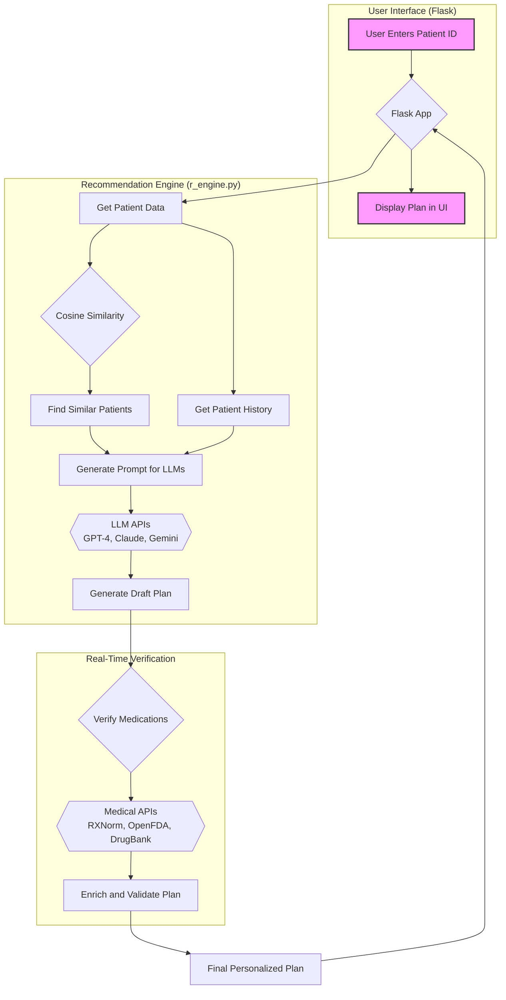

# 🏥 Advanced AI-Powered Healthcare Recommendation System


A comprehensive healthcare recommendation system that combines multiple cutting-edge technologies and medical databases to provide intelligent, personalized treatment recommendations. This system leverages realistic patient scenarios from the Synthea dataset, identifies similar patient profiles using cosine similarity, and utilizes advanced AI models (GPT-4, Claude, and Gemini) for intelligent analysis.

## ✨ Key Features

-   **🧠 Smart Patient Matching**: Utilizes cosine similarity for advanced patient analysis and recognizes historical treatment patterns to find patients with similar profiles.
-   **💊 Real-time Drug Verification**: Integrates with RXNorm, OpenFDA, and DrugBank APIs to validate medication data, check safety information, and find detailed drug interactions.
-   **📝 Intelligent Treatment Planning**: Generates personalized medication recommendations, condition-specific care plans, and preventive care suggestions.
-   **💻 User-Friendly Interface**: An interactive web dashboard built with Flask for real-time recommendation generation and detailed patient history visualization.
-   **📊 Exportable Plans**: Allows users to export the generated treatment plans for their records.

## 🛠️ Technical Architecture

The system follows a sophisticated workflow to generate personalized healthcare plans. The user initiates a request from the web interface, which triggers the recommendation engine to fetch patient data, find similar profiles, and then query large language models. The draft plan is then verified and enriched using external medical APIs before being presented to the user.



## 🚀 Getting Started

Follow these instructions to get a copy of the project up and running on your local machine for development and testing purposes.

### Prerequisites

-   Python 3.10 or higher
-   Git

### Installation

1.  **Clone the repository:**
    ```shell
    git clone https://github.com/Vinayak-Pawar/Healthcare-plan-Recommendation-System.git
    cd Healthcare-plan-Recommendation-System
    ```

2.  **Create and activate a virtual environment:**
    *   On Windows:
        ```shell
        python -m venv venv
        .\venv\Scripts\activate
        ```
    *   On macOS/Linux:
        ```shell
        python3 -m venv venv
        source venv/bin/activate
        ```

3.  **Install the required dependencies:**
    ```shell
    pip install -r Recommendation_System/UI/requirements.txt
    ```

4.  **Set up your API Keys:**
    The system requires API keys for OpenAI, Anthropic, Google Gemini, and RapidAPI.
    
    a. Create a `secrets.yaml` file inside the `Recommendation_System/` directory.
    
    b. Add your keys to this file using the following format:
    ```yaml
    # Recommendation_System/secrets.yaml

    OpenAI Chatgpt Key: "YOUR_OPENAI_API_KEY"
    Anthropic Claude API Key: "YOUR_ANTHROPIC_API_KEY"
    Perplexity API Key: "YOUR_PERPLEXITY_API_KEY"
    Google Gemini API Key: "YOUR_GEMINI_API_KEY"
    RAPIDAPI_KEY: "YOUR_RAPIDAPI_KEY"
    ```
    > **Note:** This `secrets.yaml` file is listed in `.gitignore` and will not be tracked by Git, keeping your keys secure.


### Running the Application

1.  Navigate to the UI directory:
    ```shell
    cd Recommendation_System/UI
    ```

2.  Run the Flask application:
    ```shell
    python app.py
    ```

3.  Open your web browser and go to `http://127.0.0.1:5000` to use the application.


## 📂 Project Structure
```
Healthcare-plan-Recommendation-System/
├── Recommendation_System/
│   ├── UI/                   # Contains Flask web application
│   │   ├── static/
│   │   ├── templates/
│   │   └── app.py
│   ├── Database_tables/      # Contains the Synthea dataset files
│   ├── Output/               # Default directory for exported plans
│   ├── Future_Suggestions/   # Directory for future health plans
│   ├── r_engine.py           # The core recommendation engine
│   └── secrets.yaml          # (You create this) For API keys
├── .gitignore
├── LICENSE
└── README.md
```

## License

This project is licensed under the MIT License - see the [LICENSE](LICENSE) file for details.

## 🙏 Acknowledgments

A special thanks to my mentor and team leader, **Sheetal N.**, for her invaluable guidance and support throughout the development of this project.

I would also like to thank **Darshana Jadhav** for her innovative UI and Figma designs, which were crucial in designing the web interface.
 
